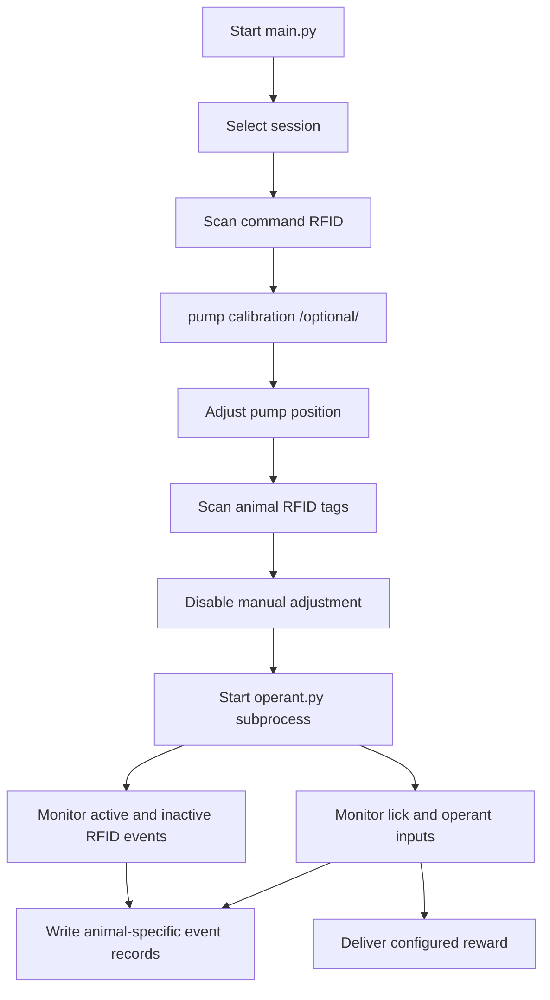

# HomeBrew

> Raspberry Pi based hardware and software for independently tracking oral operant self-administration behavior in up to four rats.

HomeBrew coordinates RFID identification, active and inactive spout events, syringe-pump movement, visual indicators, session configuration, and data recording. It is intended for experiments involving orally delivered solutions such as sucrose, alcohol, or opioids.


## Highlights

- Tracks as many as four animals independently
- Uses RFID values to identify commands and animals
- Records active and inactive behavioral events
- Controls a stepper-driven syringe pump
- Supports manual pump positioning with forward and backward controls
- Includes limit-switch protection and LED/pixel-ring feedback
- Stores session settings and pump calibration values
- Provides separate test versions of the main and operant programs
- Includes scripts for network checks and recovery from empty Python files
- Includes OpenSCAD files for project-related fabricated parts

## Repository Layout

```text
HomeBrew/
├── openscad/          # OpenSCAD models for mechanical/fabricated components
├── python/            # Experiment control, hardware control, and data collection
├── utility_script/    # Startup, integrity-check, and maintenance scripts
├── wifi-network/      # Network-related configuration or support files
├── .gitignore
└── README.md
```

## System Overview

The software is divided into two long-running responsibilities:

1. **Session controller** — `main.py` or `main_test.py`
2. **Operant controller** — `operant.py` or `operant_test.py`

The session controller reads a configured command RFID, collects the animals' RFID values, allows pump positioning during setup, and starts the operant controller as a subprocess. The session controller remains active afterward so it can continue identifying animals at the active and inactive spouts.



## Main Software Components

### `main.py` / `main_test.py`

The main entry point is responsible for:

- reading session commands
- scanning animal RFID tags
- managing the pump-positioning period
- launching the operant program
- continuing to monitor RFID input while the operant process runs
- writing active and inactive identification records

The test variant is intended for development or hardware validation. Confirm its behavior against the production script before relying on it during an experiment.

### `operant.py` / `operant_test.py`

The operant program is launched by the main program with the information required for the selected session. It manages operant events and saves recorded data to the corresponding output files.

### `pump_move.py`

This module provides a higher-level `PumpMove` abstraction over Raspberry Pi GPIO control. Its movement method drives the stepper motor forward or backward.

The motor outputs must be disabled after use. Leaving the driver energized can cause unnecessary heating.

### `RatActivityCounter`

Animal activity values, including active and inactive licking or related events, are represented through `RatActivityCounter` instances.

### Pump calibration

The calibration program compensates for changes in the relationship between motor steps and delivered volume. The operator measures the actual amount dispensed, enters that value, and the software recalculates the step setting.

Calibrate whenever the syringe, tubing, mechanical drive, solution, or pump geometry changes, and verify the resulting volume with repeated measurements.

## Experiment Workflow

1. Power the Raspberry Pi and connected hardware.
2. Confirm network status if the installation depends on network access.
3. Start the main program.
4. Scan a command RFID configured in `session_configuration.csv`.
5. Position the syringe pump before finalizing setup.
6. Scan the RFID tag for each animal assigned to the session.
7. Allow the main program to launch the operant process.
8. Monitor the apparatus and verify that active/inactive events are attributed correctly.
9. At the end of the session, confirm that all expected output files were written and safely stop the hardware.

The current logic distinguishes active and inactive RFID input by identifier length: eight characters for active input and ten characters for inactive input. Because identifier length is part of the input protocol, RFID readers and tags must be tested with the exact deployed configuration.

## Configuration

The existing code expects configuration in absolute Raspberry Pi paths.

| File | Purpose |
|---|---|
| `/home/pi/homebrew_config.json` | Stores the device ID, session number/ID, and stepper-motor step size. The session number is incremented when the program starts. |
| `/home/pi/openbehavior/HomeBrew/python/session_configuration.csv` | Defines session information and command RFID mappings. |
| `/home/pi/openbehavior/HomeBrew/python/config.py` | Centralizes directory paths and provides `get_sessioninfo(sessionid)` for reading session data from the CSV file. |


Clone this repository to the Raspberry Pi:

```bash
git clone https://github.com/miraclezero/HomeBrew.git
cd HomeBrew
```

Start the main program

```bash
cd python
python3 main_test.py
```

## Hardware

The documented setup uses the following major components:

- Raspberry Pi
- DRV8834 low-voltage stepper-motor driver
- stepper motor
- external 3–12V power adapter
- Adafruit MPR121 12-key capacitive-touch sensor
- forward and backward limit switches
- forward and backward push buttons
- pixel ring
- active and inactive LEDs
- RFID readers/antennas used by the experiment
- syringe-pump mechanism


## GPIO and Wiring Reference

All GPIO values below use **BCM numbering**, as implied by the existing documentation. Confirm this convention in the code before wiring.

### Stepper Motor Driver — DRV8834

| Driver pin | Connection |
|---|---|
| `VMOT` | Positive terminal of the external power adapter |
| `GND` | Negative terminal of the external power adapter |
| `B2`, `B1`, `A1`, `A2` | Stepper motor wires: black, green, red, and blue, respectively |
| Logic `GND` | Any Raspberry Pi ground pin |
| `M0`, `M1` | GPIO 17 and GPIO 22 |
| `SLP` | Any Raspberry Pi 3.3V pin |
| `STEP` | GPIO 6 |
| `DIR` | GPIO 26 |

The listed motor wire colors may not apply to every motor. Identify coil pairs from the motor documentation or with a meter before connecting the driver.

### Capacitive-Touch Sensor — MPR121

| MPR121 pin | Connection |
|---|---|
| `SCL` | GPIO 3 / I²C clock |
| `SDA` | GPIO 2 / I²C data |
| `3Vo` | Any Raspberry Pi 3.3V pin |
| `GND` | Any Raspberry Pi ground pin |
| `0` | Inactive-contact wire |
| `1` | Active-contact wire |

### Limit Switches

| Switch terminal | Connection |
|---|---|
| Normally Open (`NO`) | Raspberry Pi 5V connection, red wire |
| Forward contact (`C`) | GPIO 24, green wire |
| Backward contact (`C`) | GPIO 23, white wire |


### Manual Pump Buttons

| Control | Connection |
|---|---|
| Forward button | GPIO 5 |
| Backward button | GPIO 27 |
| GND connect with resistor | Any Raspberry Pi ground pin  |

### Pixel Ring

| Pixel-ring pin | Connection |
|---|---|
| `IN` | GPIO 18 |
| `GND` | Any Raspberry Pi ground pin |
| `5V DC` | Any Raspberry Pi 5 V pin |

Check the ring's maximum current demand before powering it from the Raspberry Pi header.

### Status LEDs

| LED | Connection |
|---|---|
| Active LED | GPIO 16 |
| Inactive LED | GPIO 19 |
| GND connect with resistor | Any Raspberry Pi ground pin |
